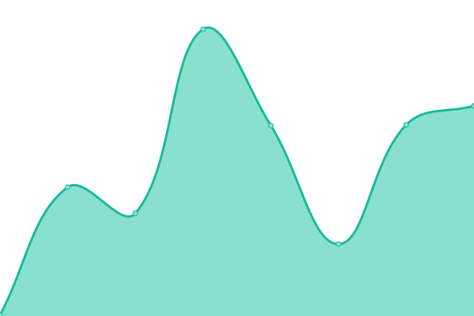

# [📈 Live Status](https://status-01.dataforcanada.org): <!--live status--> **🟩 All systems operational**

This repository contains the open-source uptime monitor and status page for [Data for Canada](https://www.dataforcanada.org), powered by [Upptime](https://github.com/upptime/upptime).

With [Upptime](https://upptime.js.org), you can get your own unlimited and free uptime monitor and status page, powered entirely by a GitHub repository. We use [Issues](https://github.com/dataforcanada/status-01.dataforcanada.org/issues) as incident reports, [Actions](https://github.com/dataforcanada/status-01.dataforcanada.org/actions) as uptime monitors, and [Pages](https://status-01.dataforcanada.org) for the status page.

<!--start: status pages-->
<!-- This summary is generated by Upptime (https://github.com/upptime/upptime) -->
<!-- Do not edit this manually, your changes will be overwritten -->
<!-- prettier-ignore -->
| URL | Status | History | Response Time | Uptime |
| --- | ------ | ------- | ------------- | ------ |
|  [www.dataforcanada.org](https://www.dataforcanada.org) | 🟩 Up | [www-dataforcanada-org.yml](https://github.com/dataforcanada/status-01.dataforcanada.org/commits/HEAD/history/www-dataforcanada-org.yml) | 

 337ms
     
 | 

<a href="https://status-01.dataforcanada.org/history/www-dataforcanada-org">100.00%</a>
    

|  [data-01.dataforcanada.org](https://data-01.dataforcanada.org) | 🟩 Up | [data-01-dataforcanada-org.yml](https://github.com/dataforcanada/status-01.dataforcanada.org/commits/HEAD/history/data-01-dataforcanada-org.yml) | 

 412ms
     
 | 

<a href="https://status-01.dataforcanada.org/history/data-01-dataforcanada-org">100.00%</a>
    

|  [data-02.dataforcanada.org](https://data-02.dataforcanada.org) | 🟩 Up | [data-02-dataforcanada-org.yml](https://github.com/dataforcanada/status-01.dataforcanada.org/commits/HEAD/history/data-02-dataforcanada-org.yml) | 

 327ms
     
 | 

<a href="https://status-01.dataforcanada.org/history/data-02-dataforcanada-org">100.00%</a>
    

|  [status-02.dataforcanada.org](https://status-02.dataforcanada.org) | 🟩 Up | [status-02-dataforcanada-org.yml](https://github.com/dataforcanada/status-01.dataforcanada.org/commits/HEAD/history/status-02-dataforcanada-org.yml) | 

 315ms
     
 | 

<a href="https://status-01.dataforcanada.org/history/status-02-dataforcanada-org">100.00%</a>
    

<!--end: status pages-->

[**Visit our status website →**](https://status-01.dataforcanada.org)

## 📄 License

- Powered by: [Upptime](https://github.com/upptime/upptime)
- Code: [MIT](./LICENSE) © [Anand Chowdhary](https://anandchowdhary.com), supported by [Pabio](https://pabio.com)
- Data in the `./history` directory: [Open Database License](https://opendatacommons.org/licenses/odbl/1-0/)
